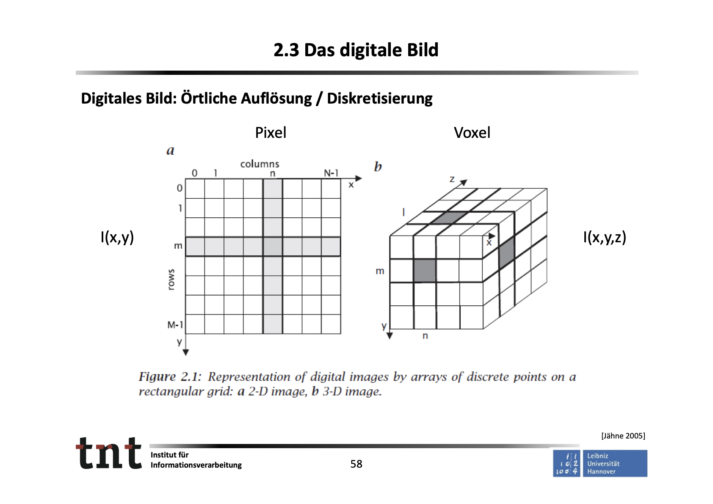
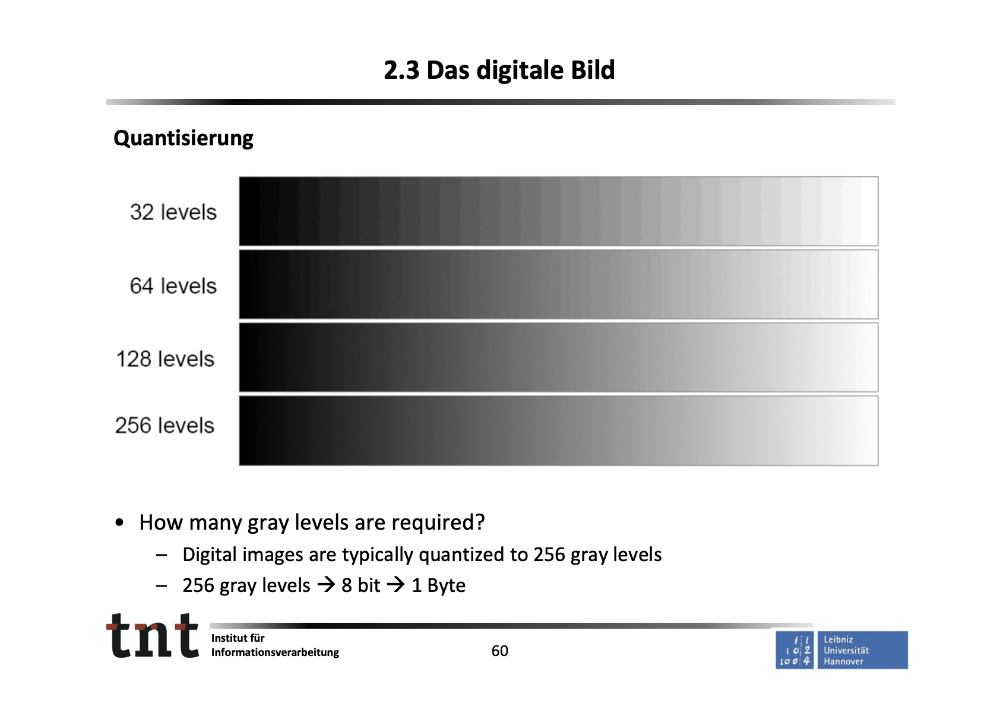

# 2_Grundlagen

Created: July 13, 2023 3:12 PM

# 2_Grundlagen

## 2.1 Das menschliche visuelle System

### Zusammenfassung:

- „Technische Daten“ des Sehsystems:
    - Örtliche Auflösung: 0.5 ‐ 2 Winkelminuten
    - Webers Gesetz
    - Machsches Gesetz
- Wichtig für Bildinterpretation sind (basierend auf Erkenntnissen aus dem Ablauf des menschlichen Sehprozesses):
    - Helligkeitsübergänge, Kanten, Ecken
    - Erfassung von lokalen Bewegungen
    - Intensitäten sind bedeutsamer als Farbe
- Technische Rechenleistung gegenüber menschlichem visuellem System derzeit noch begrenzt

## 2.2 Technische Bilderfassung/Sensoren/Arten von Bildern

Zusammenfassung:

- Unterschiedliche Arten von Sensoren
    - Flächensensor
    - Farbe
    - Zeilensensor
    - …
- Repräsentation verschiedener physikalischer Größen durch digitale Bilder
    - Bildgebende Sensoren in verschiedenen Spektralbereichen
    - Computertomographie
    - Distanzbilder

## 2.3 Das digitale Bild

### Definitionen

### Datenmengen

- Beispiel Full‐HD
    - 1920 x 1080 = 2.073.600 Bildpunkte
    - mit RGB‐Farben → 6.220.800 Werte pro Bild
    - bei 25 Frames/s → 155.520.000 Werte/s
    - bei 8bit pro pixel → **1.2 Gbit/s** (USB 2.0 480 Mbit/s)
- Herausforderungen:
    - erforderliche Rechenleistung für Bildverarbeitung
    - Bildkompression für effiziente Datenübertragung
        - DVB‐T2 ~ 3Mbit/s HEVC

### Digitales Bild: Örtliche Auflösung / Diskretisierung

### Quantisierung

<aside>
💡 How many gray levels are required?

- Digital images are typically quantized to 256 gray levels
- 256 gray levels → 8 bit → 1 Byte
</aside>

### Zusammenfassung

- Repräsentation digitaler Bilder als Matrizen/Vektorfelder
- Örtliche Diskretisierung und Quantisierung
- Farbe
- Repräsentationsformen von Bildern (Vektorfeld, Folge, Pyramide)
- Bildpunkt, ikonische Beschreibung, Segmentierung, symbolische Beschreibung
- Herausforderung Datenmengen
