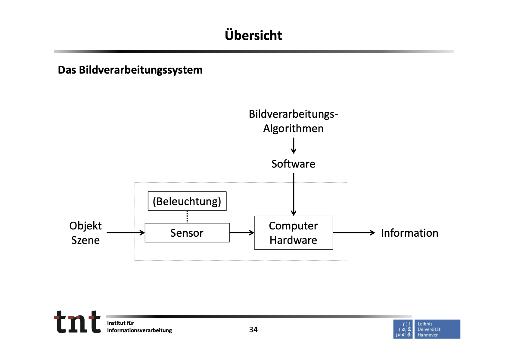

# 1_Übersicht

Created: July 13, 2023 3:12 PM

# 1_Übersicht

## 1.1 Anwendungsbeispiele der digitalen Bildverarbeitung

**Computational Photography:** Bildverbesserung, Bildeffekte, Bildmosaike, HDR‐Imaging, ...

**Industrielle Bildverarbeitung:** Qualitätskontrolle, Fehlererkennung, visuelle Steuerung, Bestückung, Sortierung, ...

**Medizinische Bildverarbeitung:** Tomographie, Thermographie, Radiologie, Sonographie, Auswertung mikroskopischer Präparate, ...

**Kommunikationstechnik:** Bildkompression, ...

**Photogrammetrie:** Luftbildauswertung, optische Messtechnik, ...

**Fernerkundung, Astronomie:** Auswertung von Luftbildern, Multispektralbildern, Radarbildern, ...

**Fahrerassistenz, Fahrerinformation:** Teilautomatisiertes Fahren, Objektdetektion, Spurerkennung, Verkehrszeichenerkennung, ...

**Sicherheitstechnik:** Videobasierte Überwachung, ...

**Büroautomatisierung:** Dokumentenanalyse, OCR‐Software (Schrifterkennung), ...

## 1.2 Abgrenzung Begriff „Digitale Bildverarbeitung“

### Definition: Digitale Bildbearbeitung

Anwendung eines Operators Ω, der ein Eingabebild f in ein Ergebnisbild g transformiert: g = Ω(f).

### Versuch einer Abgrenzung:

*Der Begriff* **digitale Bildverarbeitung** *beschreibt die ersten Schritte einer Bildauswertung, bis hin zur Bereitstellung von Merkmalen für die Bildinterpretation.*

## 1.3 Das Bildverarbeitungssystem

## 1.4 Inhalt der Lehrveranstaltung

